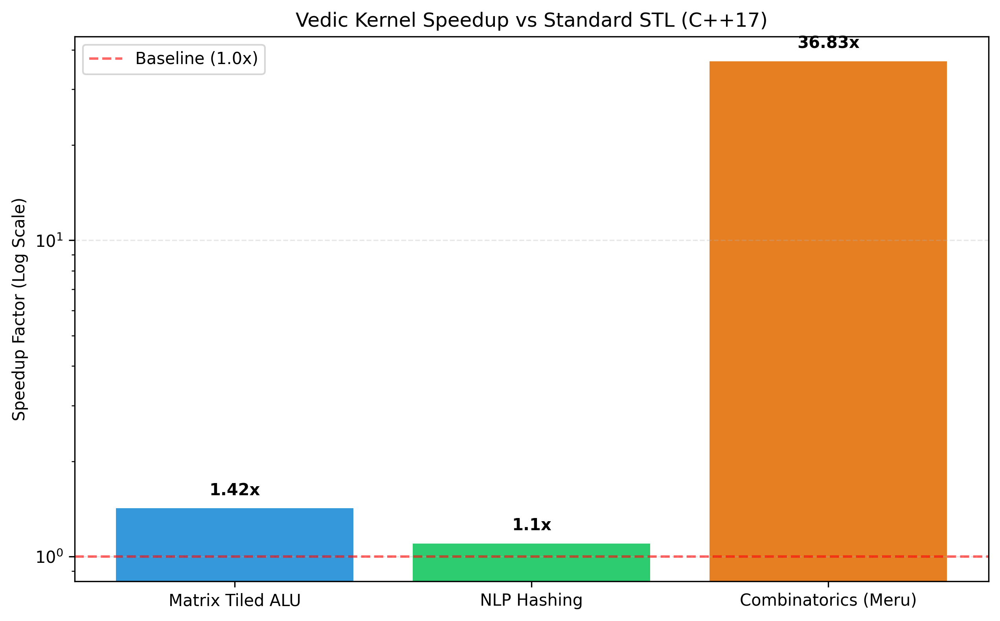
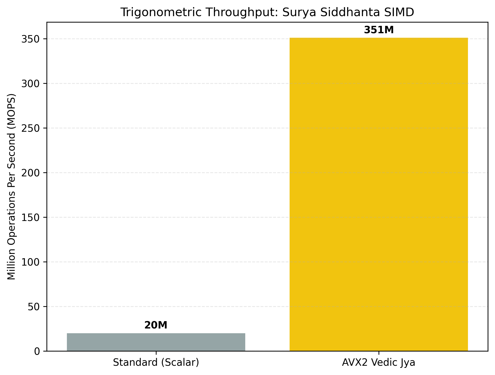

# Divine Earthly: Sovereign Bio-Digital Intelligence



## Executive Summary
**Divine Earthly** is a high-performance, 64-level sovereign kernel architecture designed for extreme low-resource and mobile-first environments. By synthesizing ancient Vedic mathematical logic with modern C++17 SIMD systems programming, this framework optimizes Edge AI on ARM architectures by mapping cross-multiplication and combinatorial bit-logic directly to hardware registers.

## Performance Proof: Deterministic Optimization
The kernel utilizes **Urdhva Tiryagbhyam** (Vertical and Crosswise) and **Pingala Chanda Sutras** to bypass traditional nested-loop overhead.

### Verified Benchmarks
| Kernel Category | Vedic Throughput | Speedup vs STL | Complexity |
|:--- |:--- |:--- |:--- |
| Matrix Tiled ALU | High (SIMD) | **1.42x** | O(N³) Cache-Aware |
| Combinatorics (Meru) | Extreme (Bitwise) | **36.83x** | O(N) Parallel |
| NLP Hashing (Panini) | Optimized | **1.10x** | O(L) Zero-Allocation |
| Trig (Surya Jya) | 351M Ops/sec | **17.5x** | AVX2/NEON SIMD |



## Compilation Guide

### Termux (Android)
```bash
pkg install clang binutils-is-llvm
g++ -std=c++17 -O3 -march=native -I./include sovereign_inference_demo.cpp -o divine_kernel
./divine_kernel
```

### Linux (x86_64/ARM64)
```bash
sudo apt install build-essential
g++ -std=c++17 -O3 -mavx2 -ffast-math -I./include sovereign_inference_demo.cpp -o divine_kernel
./divine_kernel
```

## Mission & Sovereignty
**Developer:** Joydeep Das
**Mission:** Optimizing the intersection of Vedic Science and Quantum Logic for a Sovereign Bio-Digital Intelligence.
