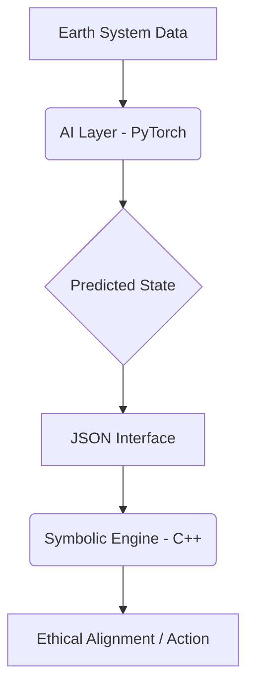

# 🌿 Divine Earthly: Sovereign Supreme Intelligence - Hybrid AI + Symbolic Kernel

## Project Overview
Divine Earthly is a hybrid neuro-symbolic AI framework bridging ancient mathematical logic with modern deep learning. This repository integrates a PyTorch-based AI learning layer with a C++ symbolic reasoning kernel (Vedic Sutras), enabling ethically aligned decision-making for Earth systems.

### 🏗️ Technical Architecture
* **AI Learning Layer (PyTorch):** Processes environmental data from `datasets/sample_earth_data.csv` to predict states.
* **Symbolic Reasoning Engine (C++ Kernel):** Applies deterministic rules from `configs/rules.json` using 32 Vedic Sutras as cognitive gates.
* **JSON Interface:** Standardized communication protocol between neural and symbolic layers.



### 🚀 Quick Start
1. **Build the Kernel:**
   ```bash
   make clean && make -j$(nproc)
   ```
2. **Run AI Inference:**
   ```bash
   python ai_layer/inference.py
   ```
3. **Consult the Demo:** Open `notebooks/demo.ipynb` in Colab.

### 🗺️ Future Roadmap
* Real-time sensor stream integration.
* Advanced reinforcement learning for rule optimization.
* Formal verification of non-violence protocols (Ahimsa).