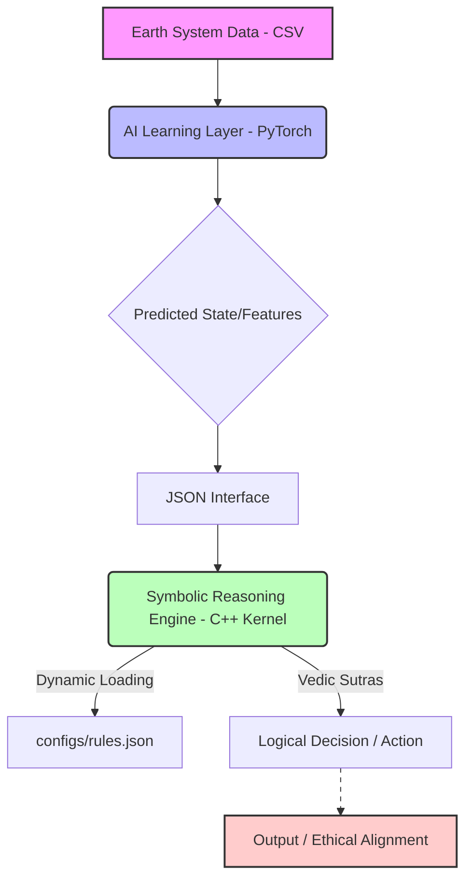

# 🌿 Divine Earthly: Sovereign Supreme Intelligence - Hybrid AI + Symbolic Kernel

## Project Overview
Divine Earthly is evolving into a hybrid neuro-symbolic AI framework, bridging ancient mathematical logic with modern deep learning and cloud scalability. This project integrates a PyTorch-based AI learning layer with a C++ symbolic reasoning kernel, enabling high-precision, ethically aligned decision-making, especially for complex Earth systems. Our goal is to provide a deterministic "Reasoning Bridge" for Large Language Models and real-world applications, ensuring interpretable and verifiable outputs.

---

### 🏗️ Technical Architecture
Our architecture is a blend of data-driven AI and rule-based symbolic reasoning:

*   **AI Learning Layer (Python/PyTorch):** Processes environmental data from `datasets/sample_earth_data.csv` to generate high-level features or predicted states (e.g., `normal`, `warning_temp`). This layer is built using Python with PyTorch and relies on `ai_layer/train_model.py`, `ai_layer/inference.py`, and `ai_layer/dataset_loader.py`.
*   **Symbolic Reasoning Engine (C++ Kernel):** Implements a logic-based reasoning system using Vedic Sutras. It takes inputs (like predicted states) from the AI layer via a JSON interface and applies deterministic rules loaded dynamically from `configs/rules.json`. This C++ engine provides interpretable, verifiable outputs based on symbolic logic and ethical guardrails.
*   **JSON Interface:** Defines the communication protocol between the AI Learning Layer and the Symbolic Engine, ensuring standardized data exchange.
*   **Dynamic Rule Loading:** The symbolic engine can load and apply rules from `configs/rules.json` at runtime, allowing for flexible ethical and operational guideline updates without recompilation.
*   **Data Integration:** Utilizes `datasets/sample_earth_data.csv` for training the AI model and simulating real-world environmental data integration.



### 🚀 Quick Start (Local Environment)

To build, train, and interact with the hybrid kernel locally:

1.  **Clone the repository:**
    ```bash
    git clone https://github.com/divineearthly/Divine-Earthly-Quantum-Vedic-Kernels.git
    cd Divine-Earthly-Quantum-Vedic-Kernels
    ```

2.  **Compile the C++ Kernel:**
    ```bash
    make clean && make -j$(nproc)
    ```

3.  **Install Python dependencies:**
    ```bash
    pip install pandas scikit-learn torch joblib
    ```

4.  **Generate `configs/rules.json` and `datasets/sample_earth_data.csv`:** (These are generated by the Colab notebook, or can be manually created as shown in `configs/rules.json` and the example data format.)

5.  **Train the AI Model:**
    ```bash
    python ai_layer/train_model.py
    ```

6.  **Run the demo notebook:** (This will showcase AI inference and symbolic kernel interaction)
    ```bash
    jupyter notebook notebooks/demo.ipynb
    ```

### 💡 Usage

*   **AI Layer:** Use `ai_layer/inference.py` to get predictions from new environmental data.
*   **Symbolic Kernel:** Interact with the compiled `./vedic_engine` binary, providing a `gate_name` (e.g., an AI prediction) and a JSON payload with relevant data. The kernel will apply rules from `configs/rules.json`.

    Example:
    ```bash
    ./vedic_engine "warning_temp" '{"temperature":28.5, "humidity":68.0}'
    ```

### 🌐 Colab Demo

A comprehensive Colab notebook demonstrating the entire setup, training, and interaction of the hybrid system is available:

*   [Divine Earthly Hybrid AI + Symbolic Kernel Demo](link_to_colab_notebook_here)

### 🗻️ Future Roadmap

*   **Expanded Data:** Integrate real-world environmental data streams and larger, more diverse datasets.
*   **Advanced AI:** Explore more sophisticated AI models (e.g., LSTMs, Transformers) for enhanced predictive capabilities.
*   **Reinforcement Learning:** Implement RL for adaptive rule tuning and dynamic policy generation based on environmental feedback.
*   **Automated Rule Learning:** Develop mechanisms for the symbolic engine to learn and refine rules from expert feedback or observed outcomes.
*   **Deployment:** Optimize for real-time deployment on edge devices and scalable cloud platforms.
*   **Formal Verification:** Enhance formal methods for verifying ethical alignment and system determinism.

---